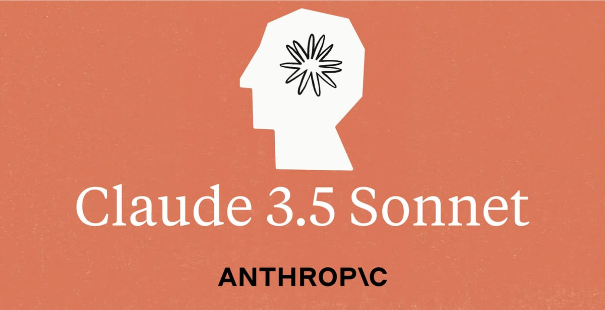

# ♟️ Chess-Xplorer ♟️

Outil interactif d'analyse et de visualisation d'échecs développé avec React + Vite.

**🌐 Application disponible ici : [https://vzwingma.github.io/chess-xplorer](https://vzwingma.github.io/chess-xplorer)**

## 📋 Description

Chess-Xplorer est une application web complète permettant de jouer aux échecs et d'analyser les positions avec des outils visuels avancés. L'application implémente toutes les règles officielles du jeu d'échecs, y compris les mouvements spéciaux comme le roque et la promotion des pions, et offre une détection automatique des échecs et échecs et mat.

## ✨ Fonctionnalités

### Jeu d'échecs complet
- **Règles officielles** : Tous les mouvements légaux pour chaque pièce (pions, tours, cavaliers, fous, dames, rois)
- **Roque** : Support complet du petit et grand roque avec validation des conditions
- **Promotion des pions** : Les pions atteignant l'extrémité opposée du plateau sont automatiquement promus en dame
- **Détection d'échec** : Le roi en échec clignote en rouge
- **Détection d'échec et mat** : Fin automatique de la partie avec indication du vainqueur et verrouillage du plateau
- **Validation des coups** : Impossible de jouer un coup qui met son propre roi en échec
- **Choix de couleur** : Au démarrage ou lors d'un reset, choisissez de jouer avec les blancs ou les noirs
- **Plateau adaptatif** : Le plateau se retourne automatiquement si vous jouez avec les noirs (pièces noires en bas)

### Interface utilisateur intuitive
- **Drag & Drop** : Déplacez les pièces en les faisant glisser
- **Clic pour jouer** : Alternative au drag & drop - cliquez sur une pièce puis sur la case de destination ou directement sur une pièce ennemie pour la capturer
- **Coups valides** : Points bleus pour les cases disponibles, points orange clair pour les cases où la pièce serait attaquée
- **Attaques possibles** : Bordure rouge sur les captures possibles
- **Plateau visuel** : Arrière-plan en image de plateau d'échecs réaliste
- **Pièces capturées** : Affichage visuel des pièces capturées de chaque camp au-dessus du plateau

### Outils d'analyse avancés
- **Attaques blanches/noires** : Visualisez toutes les pièces attaquées par chaque camp (orange pour les blancs, vert foncé pour les noirs)
- **Protection des pièces** : Bordures colorées indiquant le nombre de défenseurs (épaisseur croissante = plus de défenseurs)
- **Flash des défenseurs** : Cliquez sur une pièce pour voir temporairement tous ses défenseurs clignoter
- **Flash des attaques** : Activez l'option pour voir les pièces attaquées par la pièce sélectionnée clignoter
- **Avertissement de danger** : Les coups valides affichent un point orange si la pièce sera sous attaque après le déplacement

### Historique et sauvegarde
- **Historique interactif des coups** : Liste complète avec notation d'échecs et icônes Unicode (♟♜♞♝♛♚)
- **Navigation dans l'historique** : Cliquez sur n'importe quel coup pour revenir à cette position
- **Analyse de variantes** : Jouez des coups alternatifs depuis n'importe quelle position - l'historique se réorganise automatiquement
- **Export** : Sauvegardez vos parties dans un fichier texte avec l'historique complet, la position finale du plateau, et les pièces capturées
- **Import** : Rechargez une partie sauvegardée pour continuer ou analyser (les coups importés sont verrouillés 🔒)
- **Notation** : Format lisible avec symboles de couleur (⚪ blancs, ⚫ noirs) et notation algébrique
- **Numéro de partie** : Chaque partie possède un numéro unique à 8 chiffres pour faciliter l'identification

## 🎮 Utilisation

### Démarrer une partie
1. Lancez l'application et cliquez sur "Analyze Games"
2. Une fenêtre popup s'affiche pour choisir votre couleur :
   - **⚪ Play as White** : Vous jouez les blancs (pièces blanches en bas)
   - **⚫ Play as Black** : Vous jouez les noirs (pièces noires en bas, plateau retourné)
3. Le plateau s'affiche avec la position initiale
4. Les blancs commencent toujours (indiqué par "⚪ White to move")

### Jouer un coup
**Méthode 1 - Drag & Drop :**
- Cliquez et maintenez sur une pièce de votre couleur
- Glissez-la vers une case valide
- Relâchez pour jouer le coup

**Méthode 2 - Clic :**
- Cliquez sur une pièce pour la sélectionner (la case devient jaune)
- Les coups valides s'affichent avec des points :
  - 🔵 Point bleu = case sûre (pièce non attaquée)
  - 🟠 Point orange clair = case risquée (pièce sera attaquée)
  - 🔴 Bordure rouge = capture possible
- Cliquez sur une case valide pour y déplacer la pièce
- Ou cliquez directement sur une pièce ennemie pour la capturer

### Outils d'analyse
**Afficher les attaques :**
- Activez "⚪ White Attacks: ON" pour voir toutes les pièces noires menacées (cases oranges)
- Activez "⚫ Black Attacks: ON" pour voir toutes les pièces blanches menacées (cases vert foncé)

**Afficher les protections :**
- Activez "⚪ White Protection: ON" pour voir les pièces blanches défendues (bordures bleues)
- Activez "⚫ Black Protection: ON" pour voir les pièces noires défendues (bordures grises)
- L'épaisseur de la bordure indique le nombre de défenseurs (1 à 4+)
- Activez "🛡️ Selected piece: ON" pour voir les défenseurs d'une pièce clignoter lors de sa sélection

**Afficher les attaques d'une pièce :**
- Activez "💥 Selected piece: ON" pour voir clignoter les pièces adverses attaquées par la pièce sélectionnée

### Gérer les parties
- **📂 Import** : Charge une partie depuis un fichier .txt exporté
  - Les coups importés sont marqués avec 🔒 (verrouillés)
  - Seul le dernier coup importé est cliquable pour revenir à la position initiale d'import
  - Le tour du joueur est automatiquement déterminé selon le dernier coup
  - Le numéro de partie et les pièces capturées sont restaurés
- **💾 Export** : Sauvegarde la partie en cours dans un fichier .txt avec le numéro de partie
- **Reset Board** : Réinitialise le plateau et affiche le popup de sélection de couleur

### Navigation dans l'historique
- Cliquez sur n'importe quel coup dans l'historique pour revenir à cette position
- Le coup actuellement affiché est surligné en bleu
- Jouez un coup depuis une position antérieure : tous les coups suivants sont automatiquement supprimés
- Créez des variantes en explorant différentes continuations depuis n'importe quelle position

## 🛠️ Technologies utilisées

- **React 19.2.3** : Framework frontend
- **Vite 7.3.1** : Build tool et dev server
- **React Router DOM 7.12.0** : Navigation entre pages
- **CSS3** : Animations et styles personnalisés avec gradients et effets visuels
- **File API** : Import/Export de parties

## 📦 Installation

```bash
# Cloner le dépôt
git clone https://github.com/votre-username/chess-xplorer.git

# Installer les dépendances
cd chess-xplorer
npm install

# Lancer l'application en mode développement
npm run dev

# Build pour la production
npm run build
```

## 🎨 Structure du projet

```
chess-xplorer/
├── src/
│   ├── pages/
│   │   ├── HomePage.jsx          # Page d'accueil avec numéro de version
│   │   ├── HomePage.css          # Styles de la page d'accueil
│   │   ├── AnalyzeGames.jsx      # Moteur de jeu et analyse
│   │   └── AnalyzeGames.css      # Styles du plateau
│   ├── controllers/
│   │   ├── AnalyseGames.helper.js      # Logique du jeu (règles, validation)
│   │   └── ImportExportGames.controller.js  # Gestion import/export
│   ├── resources/                # Images des pièces et plateau
│   │   ├── plateau.png
│   │   ├── white-*.png
│   │   └── black-*.png
│   ├── App.jsx                   # Composant principal avec routage
│   └── main.jsx                  # Point d'entrée
├── package.json
├── vite.config.js
└── README.md
```

## 🎯 Règles d'échecs implémentées

### Mouvements des pièces
- **Pion (♟)** : Avance d'une case, deux cases depuis la position initiale, capture en diagonale, promotion automatique en dame en atteignant la dernière rangée
- **Tour (♜)** : Déplacement horizontal et vertical illimité
- **Cavalier (♞)** : Déplacement en "L" (2+1 cases)
- **Fou (♝)** : Déplacement diagonal illimité
- **Dame (♛)** : Combinaison tour + fou
- **Roi (♚)** : Une case dans toutes les directions + roque

### Règles spéciales
- **Roque** : 
  - Petit roque (O-O) : Roi vers la colonne g, tour de h vers f
  - Grand roque (O-O-O) : Roi vers la colonne c, tour de a vers d
  - Conditions : ni le roi ni la tour ne doivent avoir bougé, cases vides entre les deux, roi ne doit pas traverser une case attaquée

- **Promotion du pion** : Lorsqu'un pion atteint la dernière rangée, il est automatiquement promu en dame

- **Échec** : Le roi clignote en rouge, seuls les coups qui sortent de l'échec sont autorisés

- **Échec et mat** : Partie terminée automatiquement avec message de victoire, plus aucun coup possible, le plateau est verrouillé

## 🎨 Personnalisation visuelle

- **Popup de sélection de couleur** : Modal animé au démarrage avec effets de glissement
- **Animations fluides** : Clignotements des pièces en échec, flash des défenseurs et attaquants
- **Indicateurs visuels** : Couleurs et épaisseurs de bordures variables selon le contexte
- **Plateau adaptatif** : Rotation automatique du plateau selon la couleur choisie
- **Pièces capturées** : Affichage esthétique au-dessus du plateau

## 📝 Format d'export

Les parties exportées utilisent le format texte suivant :

```
Chess Game Move History
======================
Game Number: 12345678
Date: 16/1/2026, 10:30:45

1. ⚪ ♙ e2 → e4
2. ⚫ ♙ e7 → e5
3. ⚪ ♘ g1 → f3
...

Captured Pieces
===============
White captured: ⚫ ♟ ♞
Black captured: ⚪ ♙ ♗

Final Board State
=================
    a   b   c   d   e   f   g   h
  +---+---+---+---+---+---+---+---+
8 | ♜ | ♞ | ♝ | ♛ | ♚ | ♝ | ♞ | ♜ | 8
  +---+---+---+---+---+---+---+---+
...
```

## 🚀 Améliorations futures possibles

- Promotion du pion en d'autres pièces (tour, fou, cavalier)
- Support de l'en passant
- Détection du pat (stalemate)
- Suggestions de coups (moteur d'IA)
- Mode multijoueur en ligne
- Analyse de positions FEN
- Intégration avec des bases de données d'ouvertures

## 📊 État du projet

**Version actuelle** : 1.0.0

Le projet est fonctionnel avec toutes les fonctionnalités de base des échecs implémentées. La détection d'échec et mat fonctionne correctement, le plateau est adaptatif selon la couleur choisie, et le système d'import/export est opérationnel.

## 👤 Auteur

Développé avec ❤️ pour les passionnés d'échecs

Entièrement développé en mode Agent avec Claude Sonnet 4.5
